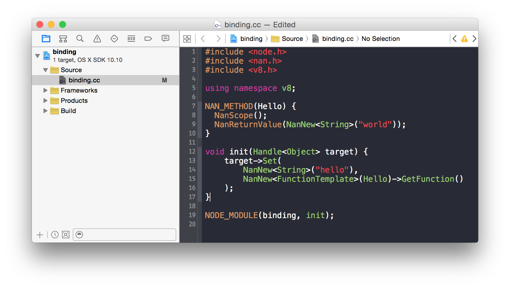
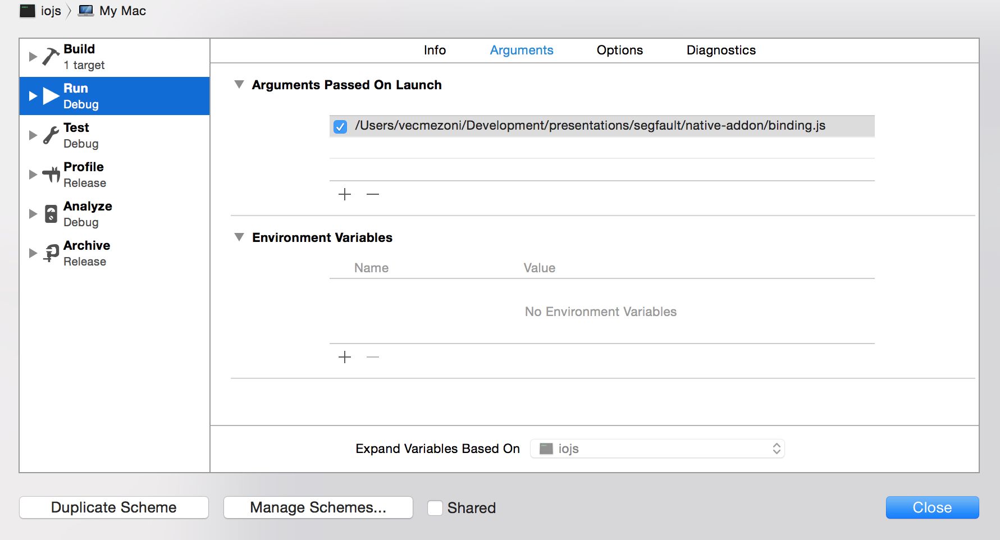

background-image: url(./i/brest.jpg)
class: center, middle, shout

# Segmentation fault
### Александр Иноземцев

---

class: center, middle, hh
# Александр Иноземцев

## Headhunter, [hh.ru](http://hh.ru)

### [@vecmezoni](https://twitter.com/vecmezoni)

---

class: center, middle, hh

### Вакансия frontend разработчика
## [http://hh.ru/vacancy/13585602](http://hh.ru/vacancy/13585602)

---

# О чем речь?

* Зачем писать Node.js Addons

* Как писать Node.js Addons

* Как поддерживать одновременно разные версии node.js и io

* Как использовать IDE для их разработки и отладки

---

# Зачем мне писать на C++?

* libxml, libxslt, libcurl, librsync, lib*...

* драйвера БД (MySQL, LevelDB, ...)

* параллельное с основным потоком исполнение кода 


---

class: center, middle, shout

# И что, мне теперь в vim'е кодить?

---

class: center, bottom, shout
background-image: url(./i/one.jpg)

# One .gyp to rule them all

---

class: shout-code

# Generate your project


```

.gyp -> .make
     -> .xcodeproj
     -> .vcproj


```

---

**binding.js**

```js
module.exports = {
  'hello': function() {
    return 'world';
  }
}
```

---

class: center, middle, shout, contain
background-image: url(./i/stroustrup.jpg)

---

**binding.cc**
```cpp
#include <node.h>
#include <v8.h>

using namespace v8;
```

---

**binding.cc**

```cpp
#include <node.h>
#include <v8.h>

using namespace v8;

void Method(const FunctionCallbackInfo<Value>& args) {
  Isolate* isolate = Isolate::GetCurrent();
  HandleScope scope(isolate);
  args.GetReturnValue().Set(
    String::NewFromUtf8(isolate, "world")
  );
}
```

---

**binding.cc**

```cpp
#include <node.h>
#include <v8.h>

using namespace v8;

void Method(const FunctionCallbackInfo<Value>& args) {
  Isolate* isolate = Isolate::GetCurrent();
  HandleScope scope(isolate);
  args.GetReturnValue().Set(
    String::NewFromUtf8(isolate, "world")
  );
}

void init(Handle<Object> target) {
  NODE_SET_METHOD(target, "hello", Method);
}

NODE_MODULE(binding, init);
```

---

**binding.gyp**
```python
{
  "targets": [
    {
      # как называется наш addon
      "target_name": "binding", 
      # что включаем в сборку
      "sources": ["binding.cc"]
    }
  ]
}
```

---

**binding.js**
```js
'use strict';

var binding = require('./build/Release/binding');

console.log('hello ' + binding.hello());
```

---

# Запускаем

```bash
$ node-gyp configure

$ node-gyp build

$ node binding.js

hello world
```

---

# А как с поддержкой?


```bash
$ node -v

v0.10.38

$ node-gyp configure

$ node-gyp build  

...
```

---

# Все очень плохо


```bash
$ node -v

v0.10.38

$ node-gyp configure

$ node-gyp build  

...
  CXX(target) Release/obj.target/binding/binding.o
../binding.cc:6:19: error: unknown type name 'FunctionCallbackInfo'
void Method(const FunctionCallbackInfo<Value>& args) {
                  ^
../binding.cc:6:39: error: expected ')'
void Method(const FunctionCallbackInfo<Value>& args) {
                                      ^
../binding.cc:6:12: note: to match this '('
void Method(const FunctionCallbackInfo<Value>& args) {
           ^
../binding.cc:8:15: error: no matching constructor for initialization of 'v8::HandleScope'
  HandleScope scope(isolate);
              ^     ~~~~~~~
...
```

---

# [nan](https://github.com/nodejs/nan)

```bash
$ npm install --save nan
```

**binding.gyp**
```python
{
  "targets": [
    {
      "target_name": "binding",
      "sources": ["binding.cc"],
      "include_dirs":
        # добавляем зависимость от nan
        ["<!(node -e \"require('nan')\")"]
    }
  ]
}
```

---

**binding.cc**
```cpp
#include <node.h>
#include <nan.h>
#include <v8.h>

using namespace v8;
```

---

**binding.cc**
```cpp
#include <node.h>
#include <nan.h>
#include <v8.h>

using namespace v8;

NAN_METHOD(Hello) {
  NanScope();
  NanReturnValue(NanNew<String>("world"));
}
```

---

**binding.cc**
```cpp
#include <node.h>
#include <nan.h>
#include <v8.h>

using namespace v8;

NAN_METHOD(Hello) {
  NanScope();
  NanReturnValue(NanNew<String>("world"));
}

void init(Handle<Object> target) {
    target->Set(
        NanNew<String>("hello"), 
        NanNew<FunctionTemplate>(Hello)->GetFunction()
    );
}

NODE_MODULE(binding, init);
```

---

# [node-bindings](https://github.com/TooTallNate/node-bindings)

<!-- Node-gyp позволяет собрать проект в debug режиме, используя ключ `--debug` или `-d`).
Для того, чтобы binding.js продолжал нормально работать необходим модуль `node-bindings`. -->

```bash
$ npm install --save bindings
```

**binding.js**
```js
'use strict';

var binding = require('bindings')('binding');

console.log('hello ' + binding.hello());
```

---

# А как же IDE?

```bash
$ node-gyp configure -- -f xcode

$ open build/binding.xcodeproj
```



---

# [nad](https://github.com/thlorenz/nad)

```bash
$ npm install -g nad

$ npm install --save nad-bindings
```

**binding.js**
```js
'use strict';

var binding = require('nad-bindings')('binding');

console.log('hello ' + binding.hello());
```

---

# [nad](https://github.com/thlorenz/nad)

```bash
$ nad inject

$ nad build

$ nad open
```

`Product -> Scheme -> Edit Scheme...`




---

background-image: url(./i/nadxcode.png)

---

background-image: url(./i/xcodeprofiler.png)

---

background-image: url(./i/xcodestack.png)

---

background-image: url(./i/xcodedebugger.png)

---

background-image: url(./i/appcode.png)

---

# Итого

* **node-gyp** для сборки проектов для различных систем/IDE

* **nan** для совместимости с различными версиями node

* **nad** для внедрения модуля в исходный код node.js

---

# Ссылки 

* [Node.js Documentation — C/C++ Addons](https://nodejs.org/api/addons.html)

* [Node.js Addon Development Made Easy with Nad - Thorsten Lorenz](http://www.youtube.com/watch?v=9n4N_apTssM)

* [Nodeschool Workshop — Going Native](https://github.com/workshopper/goingnative)

* [Nodeschool Workshop — learnuv](https://github.com/thlorenz/learnuv)

* [cmake-js](https://github.com/unbornchikken/cmake-js)

* [Generate Your Projects Documentation](https://chromium.googlesource.com/external/gyp/+/master/README.md)

* [Intro to Building Chrome with GYP](http://www.youtube.com/watch?v=DCRuOjRTR68)

* [Diving into C++ internals of node](https://blog.indutny.com/c.cpp-in-node)

---

# Контакты

- Презентация: [http://bit.ly/moscowjs-segfault](http://bit.ly/moscowjs-segfault)

- [https://github.com/vecmezoni/native-addon](https://github.com/vecmezoni/native-addon)

- [alexander.inozemtsev@gmail.com](mailto:alexander.inozemtsev@gmail.com)

- [@vecmezoni](https://twitter.com/vecmezoni)
